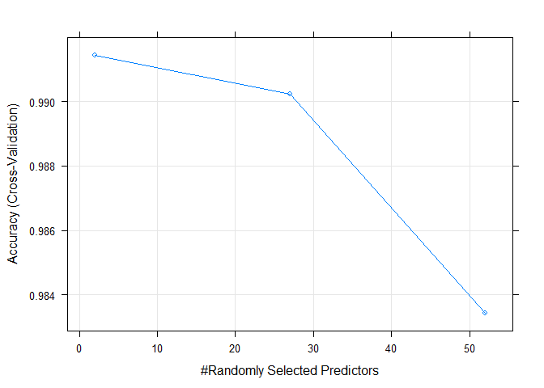

# Practical Machine Learning Project
Dave D  
October 13, 2015  


# Introduction
Using devices such as Jawbone Up, Nike FuelBand, and Fitbit it is now possible to collect a large amount of data about personal activity relatively inexpensively. These type of devices are part of the quantified self movement – a group of enthusiasts who take measurements about themselves regularly to improve their health, to find patterns in their behavior, or because they are tech geeks. One thing that people regularly do is quantify how much of a particular activity they do, but they rarely quantify how well they do it. In this project, your goal will be to use data from accelerometers on the belt, forearm, arm, and dumbell of 6 participants. They were asked to perform barbell lifts correctly and incorrectly in 5 different ways. More information is available from the website here: http://groupware.les.inf.puc-rio.br/har

# Load and Clean The Data
**Note: ** The data is assumed to be located in a sub folder named "data".

If required the data can be downloaded from the following locations

Train Data : https://d396qusza40orc.cloudfront.net/predmachlearn/pml-training.csv

Test Data  : https://d396qusza40orc.cloudfront.net/predmachlearn/pml-testing.csv


```r
#load train data
train.raw <- read.csv("data/pml-training.csv")
```

After loading the data the first action is to clean the data is to remove features that have no variability.


```r
library(caret)
nzv.data <- nearZeroVar(train.raw, saveMetrics = TRUE)
train <- train.raw[ , nzv.data$nzv == FALSE]
```

Next, columns that obviously do not affect the outcome of the models are removed.


```r
drop.cols <- c("X", "user_name", "raw_timestamp_part_1", "raw_timestamp_part_2", "cvtd_timestamp", "num_window")
keep.cols <- names(train[(!names(train) %in% drop.cols)])
train <- train[, keep.cols]
```

Next, features that contain too many NAs will be removed. 


```r
nas <- sapply(train,function(x) sum(is.na(x)))
```

From this function, it is observed that there are a number of columns that contain 19216 NA values. Since the total number of values in each column is 19622, the columns with 19216 NAs will be removed. 


```r
drop.nas <- names(nas[nas == 19216])
keep.cols <- names(train[(!names(train) %in% drop.nas)])
train <- train[, keep.cols]
```

# Model Selection

## Description of How Final Model Is Built

1. Split the train data into train and test partitions.

2. Run a number of models using the train partion.

  * Linear Discriminant Analysis (LDA) with Cross Validation.
  
  * Random Forest.

3. For each model, use the test partition to determine the accuracy and out of sample error.

4. Select the model with the best accuracy and out of sample error on the test partition.

## Data Slicing

Prior to modelling, the original training data set is split into train and test partitions with a 60/40 split.


```r
train.split <- createDataPartition(y = train$classe, p = 0.6, list = FALSE)
train.data <- train[train.split,]
test.data <- train[-train.split,]
```

## Model 1 : Linear Discriminant Analysis with Cross Validation

Initially **Linear Discriminant Analysis** Model with **Cross Validation** will be created

```r
set.seed(1235)
ldaFit <- train(classe~ .,data=train.data,method="lda", 
                trControl = trainControl(method="cv"),number=3) 
prediction.lda <- predict(ldaFit, test.data)
cf.lda <- confusionMatrix(prediction.lda, test.data$classe)
cf.lda
```

```
## Confusion Matrix and Statistics
## 
##           Reference
## Prediction    A    B    C    D    E
##          A 1816  212  155   53   60
##          B   52  950  137   54  242
##          C  179  209  869  158  131
##          D  177   59  178  974  143
##          E    8   88   29   47  866
## 
## Overall Statistics
##                                          
##                Accuracy : 0.6978         
##                  95% CI : (0.6875, 0.708)
##     No Information Rate : 0.2845         
##     P-Value [Acc > NIR] : < 2.2e-16      
##                                          
##                   Kappa : 0.6178         
##  Mcnemar's Test P-Value : < 2.2e-16      
## 
## Statistics by Class:
## 
##                      Class: A Class: B Class: C Class: D Class: E
## Sensitivity            0.8136   0.6258   0.6352   0.7574   0.6006
## Specificity            0.9145   0.9234   0.8955   0.9151   0.9731
## Pos Pred Value         0.7909   0.6620   0.5621   0.6362   0.8343
## Neg Pred Value         0.9250   0.9114   0.9208   0.9506   0.9154
## Prevalence             0.2845   0.1935   0.1744   0.1639   0.1838
## Detection Rate         0.2315   0.1211   0.1108   0.1241   0.1104
## Detection Prevalence   0.2926   0.1829   0.1970   0.1951   0.1323
## Balanced Accuracy      0.8641   0.7746   0.7654   0.8362   0.7868
```

```r
lda.accuracy <- round(cf.lda$overall["Accuracy"], 3)  # LDA Accuracy
lda.out.of.sample.error <- as.numeric(1 - lda.accuracy)  # LDA Out Of Sample error
```

From the confusion matrix we can see that the accuracy of this lda model is 0.698 which implies that the **out of sample error** is 0.302. 

## Model 2 : Random Forest

Next a Random Forest model is tried.

**Note: ** For Random Forest models, **Cross Validation** is not required.


```r
rfFit <- train(classe~ .,data=train.data,method="rf",prox=TRUE
```


To test the accuracy of the prediction, the test subset is used.


```r
prediction.rf <- predict(rfFit, test.data)
cf.rf <- confusionMatrix(prediction.rf, test.data$classe)  # Determine accuracy of model
cf.rf 
```

```
## Confusion Matrix and Statistics
## 
##           Reference
## Prediction    A    B    C    D    E
##          A 2232    6    0    0    0
##          B    0 1511    1    0    0
##          C    0    1 1366    9    0
##          D    0    0    1 1276    0
##          E    0    0    0    1 1442
## 
## Overall Statistics
##                                           
##                Accuracy : 0.9976          
##                  95% CI : (0.9962, 0.9985)
##     No Information Rate : 0.2845          
##     P-Value [Acc > NIR] : < 2.2e-16       
##                                           
##                   Kappa : 0.9969          
##  Mcnemar's Test P-Value : NA              
## 
## Statistics by Class:
## 
##                      Class: A Class: B Class: C Class: D Class: E
## Sensitivity            1.0000   0.9954   0.9985   0.9922   1.0000
## Specificity            0.9989   0.9998   0.9985   0.9998   0.9998
## Pos Pred Value         0.9973   0.9993   0.9927   0.9992   0.9993
## Neg Pred Value         1.0000   0.9989   0.9997   0.9985   1.0000
## Prevalence             0.2845   0.1935   0.1744   0.1639   0.1838
## Detection Rate         0.2845   0.1926   0.1741   0.1626   0.1838
## Detection Prevalence   0.2852   0.1927   0.1754   0.1628   0.1839
## Balanced Accuracy      0.9995   0.9976   0.9985   0.9960   0.9999
```

```r
rf.accuracy <- round(cf.rf$overall["Accuracy"], 3)  # RF Accuracy
rf.out.of.sample.error <- as.numeric(1 - rf.accuracy)  # RF Out Of Sample Error
```

From the confusion matrix we can see that the accuracy of this lda model is 0.998 which implies that the **out of sample error** is 0.002. 

## Model Selection

Based on this result, the Random Forest model will be used for the prediction. 

# Prediction
To make the predictions, the original test set is loaded. 


```r
test.raw <- read.csv("data/pml-testing.csv")
```

This test set must be modifed to have a similar format to the training data.


```r
keep.cols <- names(train[, -53]) # drop the classe variable 
keep.cols[53] <- "problem_id"  # add in a problem_id column
test <- test.raw[, keep.cols]  # Match the columns of the training set and drop the others
```
Next, predictions are made and saved in a variable called answers.

```r
answers <- as.character(predict(rfFit, test))  ## generate the prediction on real test data.
answers
```

```
##  [1] "B" "A" "B" "A" "A" "E" "D" "B" "A" "A" "B" "C" "B" "A" "E" "E" "A"
## [18] "B" "B" "B"
```


# Appendix


```r
plot(rfFit)
```

 

